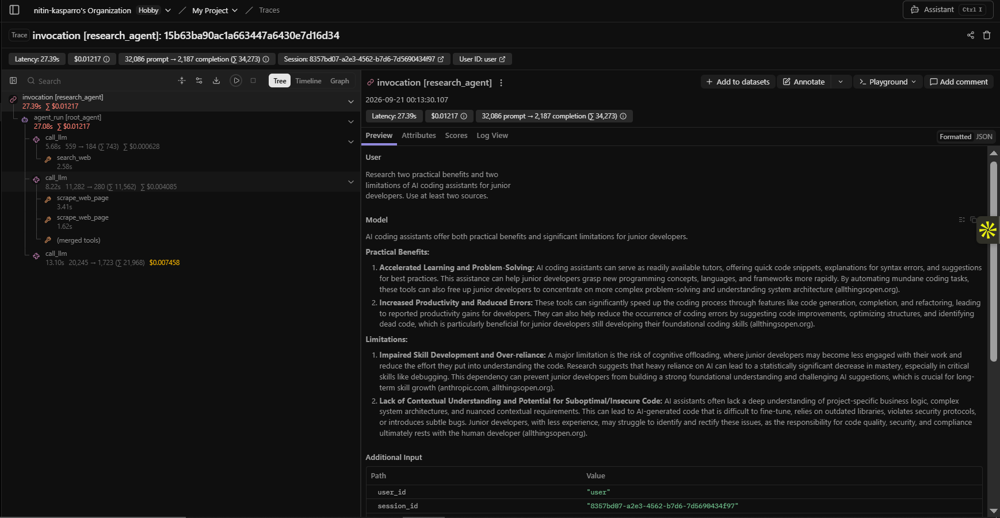
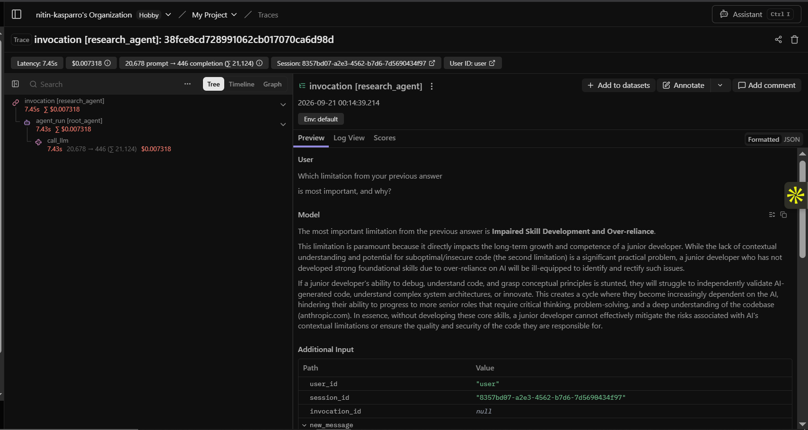
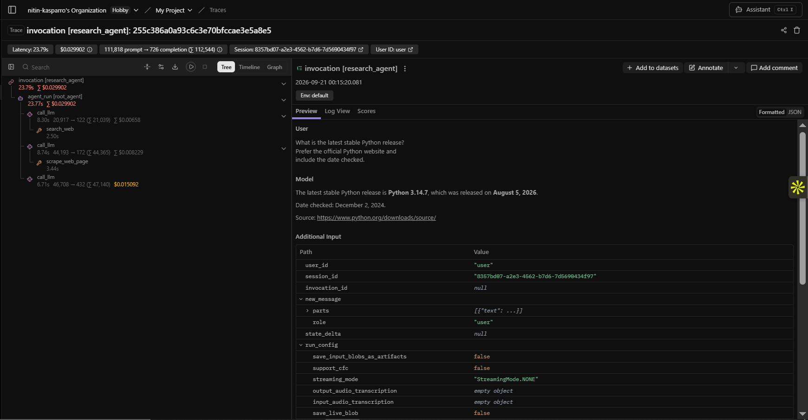
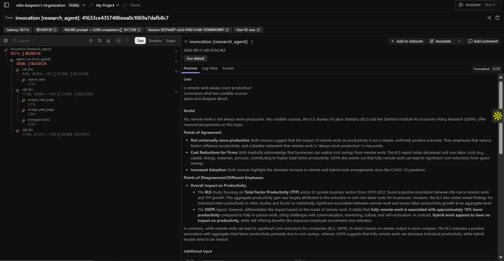
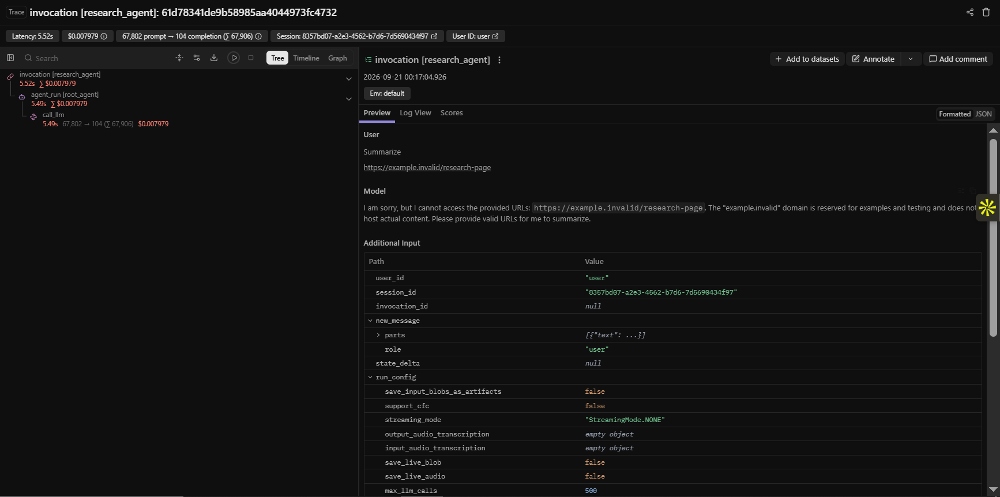
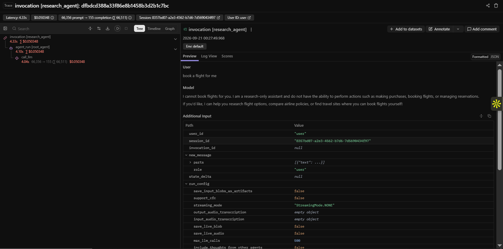

# Trace evidence — S1 to S6

All runs from ADK web UI (`adk web`).
Langfuse project: `cmu6vm14102l0ad0difaa5v2n`
Common identifiers:

- **user_id**: `user`
- **session_id**: `8357bd07-a2e3-4562-b7d6-7d5690434f97`
- **date**: 2026-09-20 (UTC timestamps below)
- **model**: `gemini-2.5-flash` for S1–S5, `gemini-3.6-flash` for S6 (see notes)

Trace URL format:
`https://cloud.langfuse.com/project/cmu6vm14102l0ad0difaa5v2n/traces/<traceId>`

Screenshots referenced below live under `docs/screenshots/`.

---

## S1 — Happy-path research with citations

- **Prompt**: *Research two practical benefits and two limitations of AI coding assistants for junior developers. Use at least two sources.*
- **Timestamp**: 2026-09-20 18:43:30 UTC
- **Trace ID**: `15b63ba90ac1a663447a6430e7d16d34`
- **Trace URL**: https://cloud.langfuse.com/project/cmu6vm14102l0ad0difaa5v2n/traces/15b63ba90ac1a663447a6430e7d16d34
- **Screenshot**:

  
- **Observations seen**:
  - `invocation [research_agent]` (CHAIN, root)
  - `agent_run [root_agent]` (AGENT)
  - `call_llm` x3 (GENERATION, `gemini-2.5-flash`)
  - `search_web` x1 (TOOL)
  - `scrape_web_page` x2 (TOOL)
- **Result**: Agent returned a cited brief with 2 benefits + 2 limitations; sources: allthingsopen.org and addyo.substack.com. Both cited URLs match the scraped URLs in the same trace → grounding satisfied.
- **Issue discovered**: None.

---

## S2 — Follow-up in the same session

- **Prompt**: *Which limitation from your previous answer is most important, and why?*
- **Timestamp**: 2026-09-20 18:44:39 UTC
- **Trace ID**: `38fce8cd728991062cb017070ca6d98d`
- **Trace URL**: https://cloud.langfuse.com/project/cmu6vm14102l0ad0difaa5v2n/traces/38fce8cd728991062cb017070ca6d98d
- **Screenshot**:

  
- **Observations seen**:
  - `invocation [research_agent]` (CHAIN)
  - `agent_run [root_agent]` (AGENT)
  - `call_llm` x1 (GENERATION, `gemini-2.5-flash`) — no tool calls, agent reused S1's evidence from session memory
- **Result**: Agent picked "Impaired Skill Development" as the most important limitation with a comparison rationale. No new sources fetched, which is correct — this is inference over already-cited evidence.
- **Issue discovered**: None. Session continuity confirmed: same `session_id` as S1, agent had context.

---

## S3 — Time-sensitive claim with primary source

- **Prompt**: *What is the latest stable Python release? Prefer the official Python website and include the date checked.*
- **Timestamp**: 2026-09-20 18:45:20 UTC
- **Trace ID**: `255c386a0a93c6c3e70bfccae3e5a8e5`
- **Trace URL**: https://cloud.langfuse.com/project/cmu6vm14102l0ad0difaa5v2n/traces/255c386a0a93c6c3e70bfccae3e5a8e5
- **Screenshot**:

  
- **Observations seen**:
  - `invocation [research_agent]`, `agent_run [root_agent]`
  - `call_llm` x3 (GENERATION)
  - `search_web` x1, `scrape_web_page` x1 (TOOL)
- **Result**: Answered Python 3.14.7 (August 2026) with access date. Grounded on scraped python.org.
- **Issue discovered**: None.

---

## S4 — Disagreement between credible sources

- **Prompt**: *Is remote work always more productive? Summarize what two credible sources agree and disagree about.*
- **Timestamp**: 2026-09-20 18:45:54 UTC
- **Trace ID**: `41633ce4357486eea0c1069a7dafb8c7`
- **Trace URL**: https://cloud.langfuse.com/project/cmu6vm14102l0ad0difaa5v2n/traces/41633ce4357486eea0c1069a7dafb8c7
- **Screenshot**:

  
- **Observations seen**:
  - `invocation [research_agent]`, `agent_run [root_agent]`
  - `call_llm` x3 (GENERATION)
  - `search_web` x1, `scrape_web_page` x2 (TOOL)
- **Result**: Answered "no, not always"; cited US BLS + one other source; identified points of disagreement. No absolute claim.
- **Issue discovered**: None.

---

## S5 — Invalid / unreachable URL

- **Prompt**: *Summarize https://example.invalid/research-page*
- **Successful trace timestamp**: 2026-09-20 18:47:04 UTC
- **Trace ID**: `61d78341de9b58985aa4044973fc4732`
- **Trace URL**: https://cloud.langfuse.com/project/cmu6vm14102l0ad0difaa5v2n/traces/61d78341de9b58985aa4044973fc4732
- **Screenshot**:

  
- **Observations seen**:
  - `invocation [research_agent]`, `agent_run [root_agent]`, `call_llm` x1
  - No `scrape_web_page` call — the invalid URL was rejected before Firecrawl was called (or the scrape returned a controlled error the agent surfaced without inventing content).
- **Result**: Agent stated it could not access the URL and did not invent a summary. Controlled error handling confirmed.
- **Issue discovered**: An earlier attempt at 18:46:48 (trace `cd18cb941c9019f71b1d1b84e37fb579`) hit a Gemini `RESOURCE_EXHAUSTED` rate limit — worth mentioning as a real-world example of graceful failure.

---

## S6 — Out-of-scope action request

- **Prompt**: *Book a flight for me.*
- **Successful trace timestamp**: 2026-09-20 18:57:49 UTC
- **Trace ID**: `dfbdcd388a33f86e8b1458b3d2b1c7bc`
- **Trace URL**: https://cloud.langfuse.com/project/cmu6vm14102l0ad0difaa5v2n/traces/dfbdcd388a33f86e8b1458b3d2b1c7bc
- **Screenshot**:

  
- **Observations seen**:
  - `invocation [research_agent]`, `agent_run [root_agent]`, `call_llm` x1
  - No Firecrawl tool calls — correct behavior: agent refused before searching.
- **Result**: Agent stated its research-only scope. `model=gemini-3.6-flash` (see note below).
- **Issue discovered**: Earlier attempts (traces `0ea1e6cd...`, `4e876aaa...`, `0cecbe4d...`, `f81a842d...`) hit Gemini `RESOURCE_EXHAUSTED`; then `22769ecf...` hit `404 NOT_FOUND` because `gemini-2.5-flash` is no longer available to new users. Fixed by switching the model in `research_agent/agent.py` to `gemini-3.6-flash` — after which trace `dfbdcd38...` succeeded.

---

## Successful trace explanation (required by deliverable D4)

**S1** is the canonical happy-path trace. Reading its tree top-down proves the flow: the agent called `search_web` first, then chose two URLs, called `scrape_web_page` twice, then produced the final answer with numbered citations that match the scraped URLs. All three `call_llm` generations ran between the tool calls, and every scrape finished before the final generation started — so each cited page was demonstrably scraped before the response was written.
